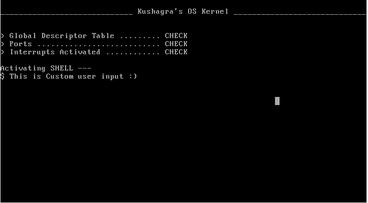

# Operating System

> [!CAUTION]
> **Do Not Install on Your Main System**
> 
> **This operating system is under development and not suitable for general use.** Installing it on your primary system could potentially lead to data loss or system instability.
> 
> **For testing purposes only, please use a virtual machine like VirtualBox or VMware.**



A 32-bit Operating System written from scratch in C++
 
> This project is in development
> This Operating system is not meant for general usage, as this is a very bare-bones Operating System and made only for learning and educational purposes

# Status

In the current status, this Operating System can only handle user inputs to type and mouse movements

# Installation

In order to build this from source ...

1. Install dependencies

```bash
sudo apt-get install g++ binutils libc6-dev-i386
sudo apt-get install grub-legacy xorriso
```

2. Build the ISO image

```bash
make mykernel.iso
```

3. Run on a Virtual Machine using VirtualBox or VM Ware

# Disk Creation

> In order to add a Master Boot Record to your Virtual Disk Image for virtualbox:

```bash
dd if=<disk.vdi> of=<disk.img>
fdisk <disk.img>
qemu-img convert <disk.img> -O vdi <disk.vdi>
```